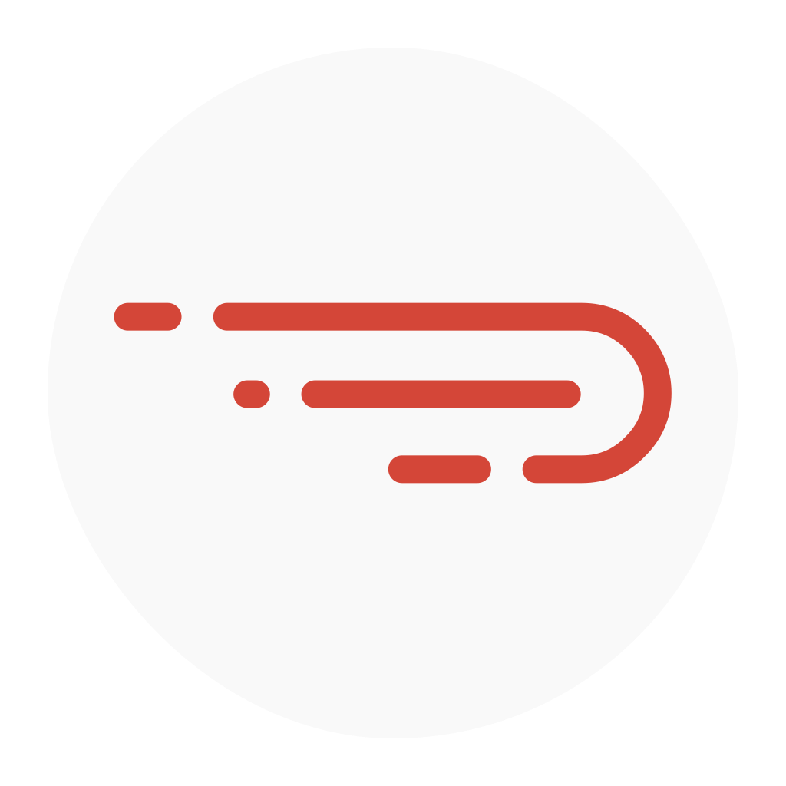
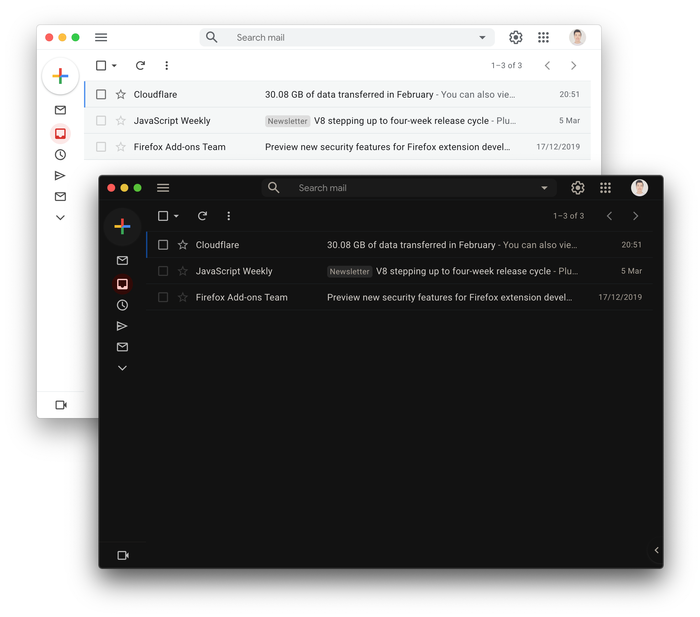
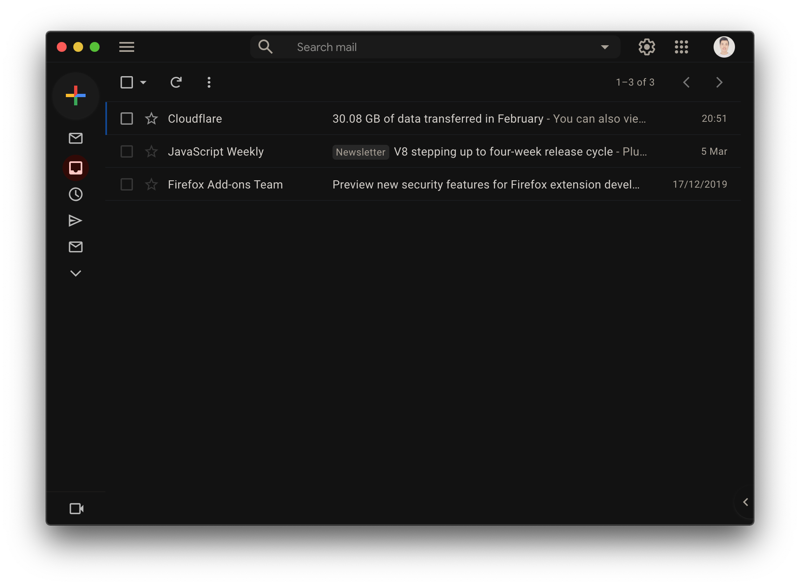
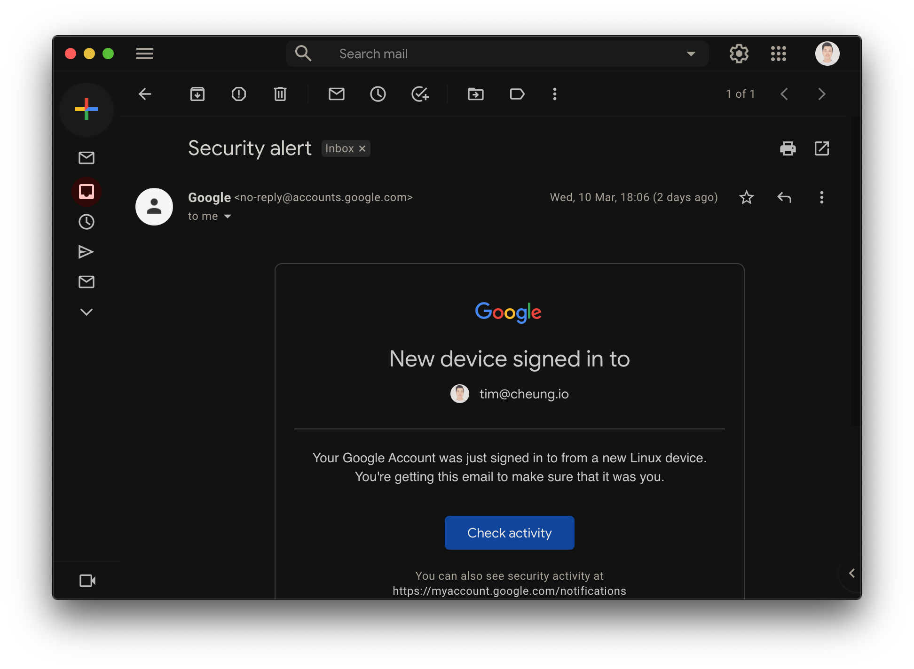
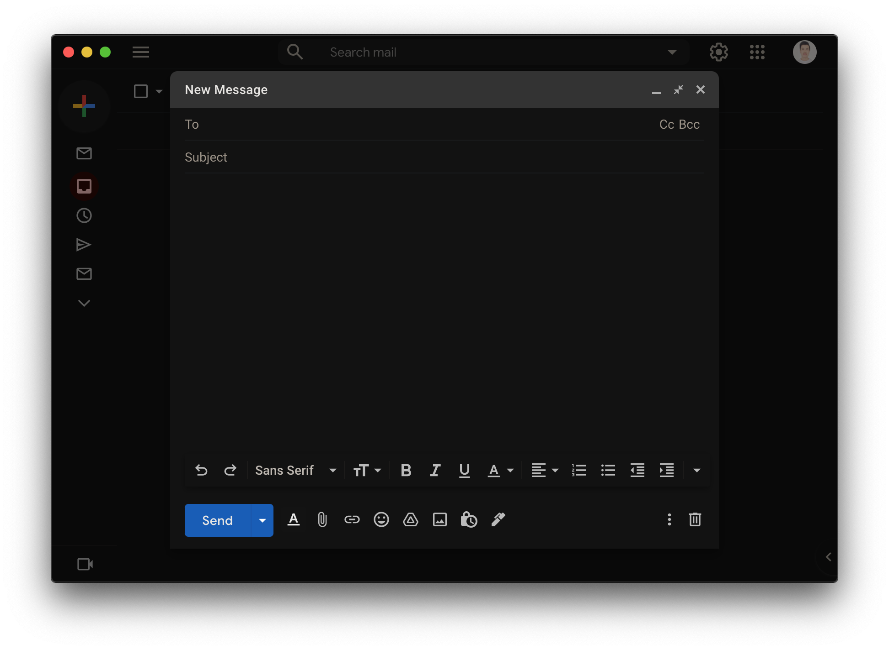
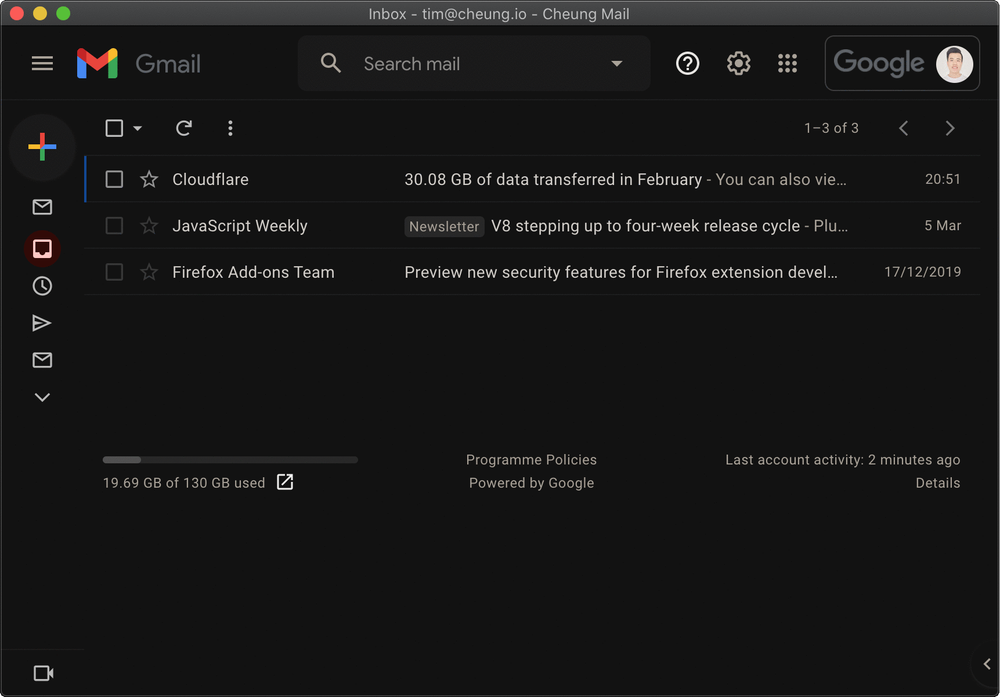
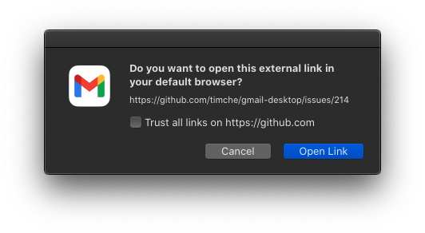
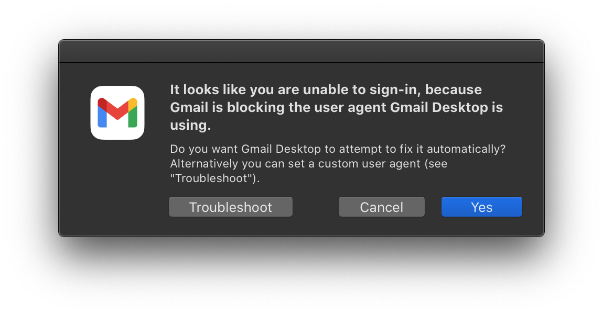

<div align="center">
	
	<h1>Gmail Desktop</h1>
	<p>
		Nifty Gmail desktop app for macOS, Linux & Windows
	</p>
  
</div>

## Highlights

- [Dark mode](#dark-mode)
- [Appearance customizations](#appearance-customizations)
- [Custom styles](#custom-styles)
- [Clean email links from Google](#clean-email-links-from-google)
- [Confirm email links before opening to prevent phishing](#confirm-email-links-before-opening-to-prevent-phishing)
- [Menu bar mode](#menu-bar-mode-macos) _(macOS)_
- Unread badge in dock _(macOS)_
- Unread icon in tray _(Linux/Windows)_
- Desktop notifications (["New mail notifications on" must be enabled](https://support.google.com/mail/answer/1075549?co=GENIE.Platform%3DDesktop) in Gmail settings)
- Silent auto-updates
- Cross-platform

## Installation

> **We are currently testing v3.0.0-alpha which includes the long-awaited support for multi-accounts! Read more [here](https://github.com/timche/gmail-desktop/discussions/242).**

_macOS 10.13+, Linux and Windows 8+ are supported (64-bit only)._

#### macOS

[**Download**](https://github.com/timche/gmail-desktop/releases/latest) the latest `.dmg` file.

Or with [Homebrew Cask](https://caskroom.github.io/): `brew install timche-gmail-desktop`

#### Linux

[**Download**](https://github.com/timche/gmail-desktop/releases/latest) the latest `.AppImage` or `.deb` file.

#### Windows

[**Download**](https://github.com/timche/gmail-desktop/releases/latest) the latest `.exe` file.

## Features

### Dark Mode

While Gmail offers a dark theme, it's unfortunately not a dark mode, so areas such as compose and emails remain untouched and keep their light appearance. Gmail Desktop comes with dark mode (powered by [Dark Reader](https://github.com/darkreader/darkreader)) and makes composing and reading emails easy on the eye as well. You can configure dark mode in the `Settings` → `Dark Mode` menu.

**Note:** It's recommended to set the [Gmail theme to "Default"](https://mail.google.com/#settings/oldthemes) in order for dark mode to work properly.

<div align="center">
  
  
  
</div>

### Appearance Customizations

Gmail Desktop provides few appearance customizations to simplify the default Gmail layout and remove some clutter. These customizations are enabled by default and configurable in the `Settings` → `Appearance` menu.

- `Compact Header`: Makes the Gmail header more compact to provide a more native feel.
- `Hide Support`: Hides the support button in the header.
- `Hide Footer`: Hides footer (storage used, terms links, etc.).

<div align="center">
  <br>
  
  <br>
</div>

### Custom Styles

If you wish to add your own styles, click the menu item `Settings` → `Appearance` → `Custom Styles` to open the app custom CSS file in your default editor.

### Confirm Email Links Before Opening to Prevent Phishing

Confirm email links can be disabled at `Settings` → `Confirm External Links before Opening`.

<div align="center">
  
</div>

### Clean Email Links from Google

Some Email links in Gmail are prepended with `https://google.com/url?q=<actual_url>`, which is somtimes not visible to the user. We believe it does some sort of analytics or tracking, so not necesary. Gmail Desktop automatically cleans links from this, so the actual URL will be directly opened in your default browser.

### Menu Bar Mode _(macOS)_

You can enable the menu bar mode with `Settings` → `Show Menu Bar Icon` and remove Gmail Desktop from the dock with `Hide Dock Icon` in the menu bar icon menu.

## Troubleshooting

#### I can't sign in: `This browser or app may not be secure`

<details>
  <summary>Read more</summary>

In December 2019 Google has decided to block unsupported user agents, such as Electron, from signing in to Google accounts for security reasons (related issue: [#174](https://github.com/timche/gmail-desktop/issues/174)). This only affects some users, but not all.

We doubt this will ever change, so we are required to override the Electron default user agent with a supported user agent in order to sign in successfully.

Gmail Desktop offers to attempt to automatically fix the user agent when the issue above occurs:

<div align="center">
  
</div>

Clicking on `Yes` will set a [custom user agent (based on Firefox)](https://github.com/timche/gmail-desktop/blob/main/src/user-agents.json) in the app config and Gmail Desktop will be restarted.

In case the custom user agent isn't working anymore, you'll be offered to let Gmail Desktop to attempt to fix it again or trigger it manually at `Settings` → `Advanced` → `User Agent` → `Attempt User Agent Fix`.

If the automatic user agent fix isn't working at all or you want to set your own custom user agent, you are able to do that at `Settings` → `Advanced` → `User Agent` → `Set Custom User Agent`, which opens the app config in your editor.

In the app config, edit the `customUserAgent` value with an user agent from e.g. https://www.whatismybrowser.com/guides/the-latest-user-agent.

Example:

```json
{
  "customUserAgent": "Some User Agent"
}
```

Save the config, restart Gmail Desktop and sign in again.

</details>

## Developing

Built with [Electron](https://github.com/electron/electron).

#### Install

```sh
yarn install
```

#### Run

```sh
yarn start
```

#### Build

```sh
# Compile TypeScript files
yarn compile

# Build app for all targets
yarn build

# Or build app for specific target
yarn build:<macos|linux|windows>
```

The build output can be found in the `dist/` folder.

## Maintainers

- [Tim Cheung](https://github.com/timche)

## Contributors

Thanks goes to these wonderful people ([emoji key](https://allcontributors.org/docs/en/emoji-key)):

<!-- ALL-CONTRIBUTORS-LIST:START - Do not remove or modify this section -->
<!-- prettier-ignore-start -->
<!-- markdownlint-disable -->
<table>
  <tr>
    <td align="center"><a href="http://www.ramin.it"><br /><sub><b>Ramin Banihashemi</b></sub></a><br /><a href="https://github.com/timche/gmail-desktop/commits?author=bsramin" title="Code">💻</a> <a href="#ideas-bsramin" title="Ideas, Planning, & Feedback">🤔</a></td>
    <td align="center"><a href="https://github.com/cdloh"><br /><sub><b>Callum Loh</b></sub></a><br /><a href="https://github.com/timche/gmail-desktop/commits?author=cdloh" title="Code">💻</a></td>
    <td align="center"><a href="https://github.com/herrevilkitten"><br /><sub><b>herrevilkitten</b></sub></a><br /><a href="https://github.com/timche/gmail-desktop/commits?author=herrevilkitten" title="Code">💻</a></td>
    <td align="center"><a href="https://zhuzilin.github.io/"><br /><sub><b>Zilin Zhu</b></sub></a><br /><a href="https://github.com/timche/gmail-desktop/commits?author=zhuzilin" title="Code">💻</a></td>
    <td align="center"><a href="https://volution.ro/ciprian"><br /><sub><b>Ciprian Dorin Craciun</b></sub></a><br /><a href="#ideas-cipriancraciun" title="Ideas, Planning, & Feedback">🤔</a></td>
    <td align="center"><a href="https://github.com/cyfrost"><br /><sub><b>Cyrus Frost</b></sub></a><br /><a href="https://github.com/timche/gmail-desktop/commits?author=cyfrost" title="Code">💻</a> <a href="#maintenance-cyfrost" title="Maintenance">🚧</a></td>
    <td align="center"><a href="https://www.zzpxyx.com"><br /><sub><b>Zhipeng Zhang</b></sub></a><br /><a href="https://github.com/timche/gmail-desktop/commits?author=zzpxyx" title="Code">💻</a></td>
  </tr>
  <tr>
    <td align="center"><a href="https://github.com/hell0-Wor1d"><br /><sub><b>Jérôme Lemaire</b></sub></a><br /><a href="https://github.com/timche/gmail-desktop/commits?author=hell0-Wor1d" title="Code">💻</a></td>
    <td align="center"><a href="https://github.com/weichenw"><br /><sub><b>Wei Chen</b></sub></a><br /><a href="#platform-weichenw" title="Packaging/porting to new platform">📦</a></td>
    <td align="center"><a href="https://github.com/DinCahill"><br /><sub><b>Donal Cahill</b></sub></a><br /><a href="https://github.com/timche/gmail-desktop/commits?author=DinCahill" title="Code">💻</a></td>
  </tr>
</table>

<!-- markdownlint-restore -->
<!-- prettier-ignore-end -->

<!-- ALL-CONTRIBUTORS-LIST:END -->

This project follows the [all-contributors](https://github.com/all-contributors/all-contributors) specification. Contributions of any kind welcome!

## Disclaimer

Gmail Desktop is a third-party app and not affiliated with Google.
