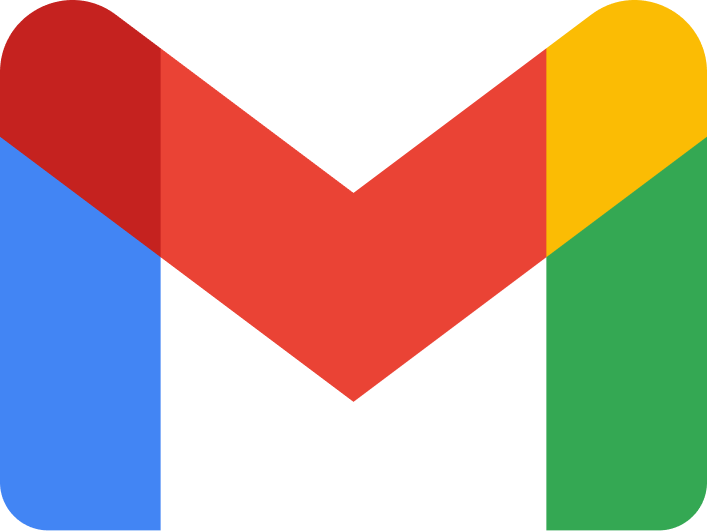
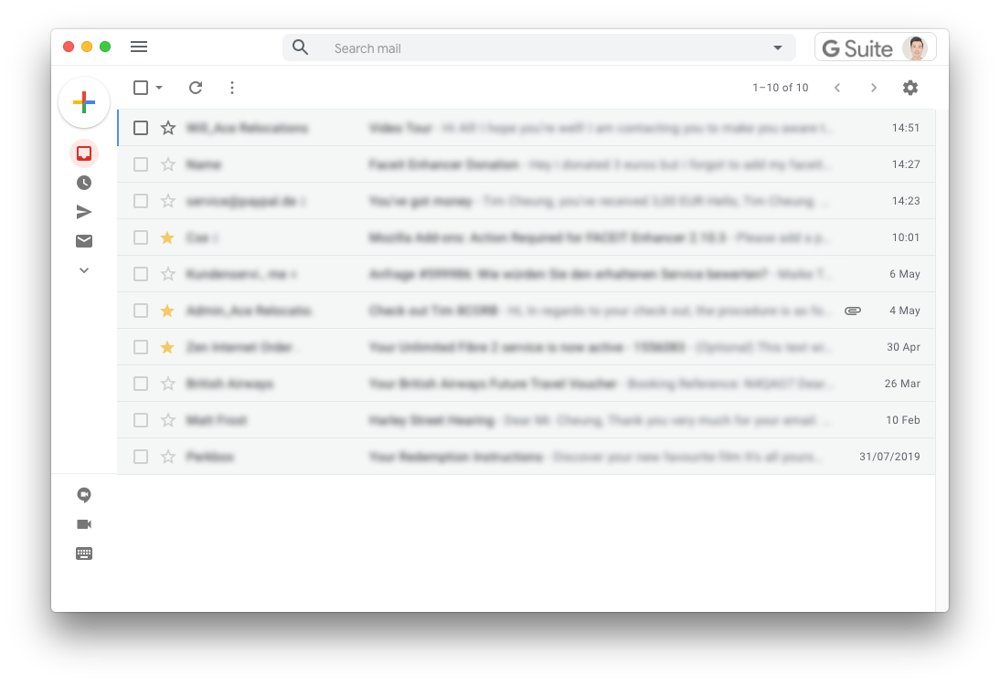

#  Gmail Desktop

[](https://travis-ci.org/timche/gmail-desktop)
[](https://github.com/timche/gmail-desktop/releases/latest)
[](https://github.com/sindresorhus/xo)
[](https://github.com/prettier/prettier)
[](#contributors)

> Gmail Desktop App built with [Electron](https://github.com/electron/electron)



## Highlights

- Native Gmail interface
- Cross-platform
- Desktop notifications
- Unread badge in macOS dock & icon Windows/Linux tray
- Silent auto-updates
- [Appearance customizations](#appearance-customizations)
- [Custom styles](#custom-styles)

## Installation

_macOS 10.10+, Linux and Windows 7+ are supported._

#### macOS

[**Download**](https://github.com/timche/gmail-desktop/releases/latest) the latest `.dmg` file.

#### Linux

[**Download**](https://github.com/timche/gmail-desktop/releases/latest) the latest `.AppImage` or `.deb` file.

#### Windows

[**Download**](https://github.com/timche/gmail-desktop/releases/latest) the latest `.exe` file.

## Features

### Appearance Customizations

Gmail Desktop provides a number of appearance customizations to improve and simplify the default Gmail styles. These customizations are listed under the `Settings` → `Appearance` menu.

- Compact Header - Customizes the Gmail header to use a more compact style to provide a more native feel. This setting requires a restart to be applied.
- Hide Footer - Hides footer information text (storage used, terms links, etc.).
- Hide Right Sidebar - Hides the Google apps sidebar on the right side of the interface.
- Hide Support - Hides the support button in the header.

### Custom styles

In addition to the available appearance customizations, users can add additional custom styles. Click the menu item `Settings` → `Appearance` → `Custom Styles` to open the custom css file in the default editor for CSS files.

## Troubleshooting

#### I can't sign in: `This browser or app may not be secure`

In December 2019 Google has decided to block non-browser user agents, such as `Electron`, from signing in to the Google accounts for security reasons ([related issue](https://github.com/timche/gmail-desktop/issues/174)).

Until we find a solution, you are able to override the user agent via the menu `Settings` → `Advanced` → `Edit Config File`, which opens the JSON config file in your editor.

In the config file, add a new key `overrideUserAgent` and set your user agent from [whatsmyua.info](https://www.whatsmyua.info/) as value.

Example:

```json
{
  "overrideUserAgent": "Mozilla/5.0 (Macintosh; Intel Mac OS X 10_15_1) AppleWebKit/537.36 (KHTML, like Gecko) Chrome/78.0.3904.108 Safari/537.36"
}
```

Save the file, restart Gmail Desktop and sign in again.

**Note:** If your user agent is not working, try one from a [different browser](https://www.whatismybrowser.com/guides/the-latest-user-agent).

## Developing

Built with [Electron](https://github.com/electron/electron).

#### Install

```sh
yarn install
```

#### Run

```sh
yarn start
```

#### Build

```sh
yarn dist
```

## Maintainers

- [Tim Cheung](https://github.com/timche)
- [Mark Skelton](https://github.com/mskelton)

## Contributors

Thanks goes to these wonderful people ([emoji key](https://allcontributors.org/docs/en/emoji-key)):

<!-- ALL-CONTRIBUTORS-LIST:START - Do not remove or modify this section -->
<!-- prettier-ignore-start -->
<!-- markdownlint-disable -->
<table>
  <tr>
    <td align="center"><a href="http://www.ramin.it"><br /><sub><b>Ramin Banihashemi</b></sub></a><br /><a href="https://github.com/timche/gmail-desktop/commits?author=bsramin" title="Code">💻</a> <a href="#ideas-bsramin" title="Ideas, Planning, & Feedback">🤔</a></td>
    <td align="center"><a href="https://github.com/cdloh"><br /><sub><b>Callum Loh</b></sub></a><br /><a href="https://github.com/timche/gmail-desktop/commits?author=cdloh" title="Code">💻</a></td>
    <td align="center"><a href="https://github.com/herrevilkitten"><br /><sub><b>herrevilkitten</b></sub></a><br /><a href="https://github.com/timche/gmail-desktop/commits?author=herrevilkitten" title="Code">💻</a></td>
    <td align="center"><a href="https://zhuzilin.github.io/"><br /><sub><b>Zilin Zhu</b></sub></a><br /><a href="https://github.com/timche/gmail-desktop/commits?author=zhuzilin" title="Code">💻</a></td>
    <td align="center"><a href="https://volution.ro/ciprian"><br /><sub><b>Ciprian Dorin Craciun</b></sub></a><br /><a href="#ideas-cipriancraciun" title="Ideas, Planning, & Feedback">🤔</a></td>
    <td align="center"><a href="https://github.com/cyfrost"><br /><sub><b>Cyrus Frost</b></sub></a><br /><a href="https://github.com/timche/gmail-desktop/commits?author=cyfrost" title="Code">💻</a> <a href="#maintenance-cyfrost" title="Maintenance">🚧</a></td>
    <td align="center"><a href="https://www.zzpxyx.com"><br /><sub><b>Zhipeng Zhang</b></sub></a><br /><a href="https://github.com/timche/gmail-desktop/commits?author=zzpxyx" title="Code">💻</a></td>
  </tr>
</table>

<!-- markdownlint-enable -->
<!-- prettier-ignore-end -->
<!-- ALL-CONTRIBUTORS-LIST:END -->

This project follows the [all-contributors](https://github.com/all-contributors/all-contributors) specification. Contributions of any kind welcome!

## Disclaimer

Gmail Desktop is a third-party app and not affiliated with Google.
