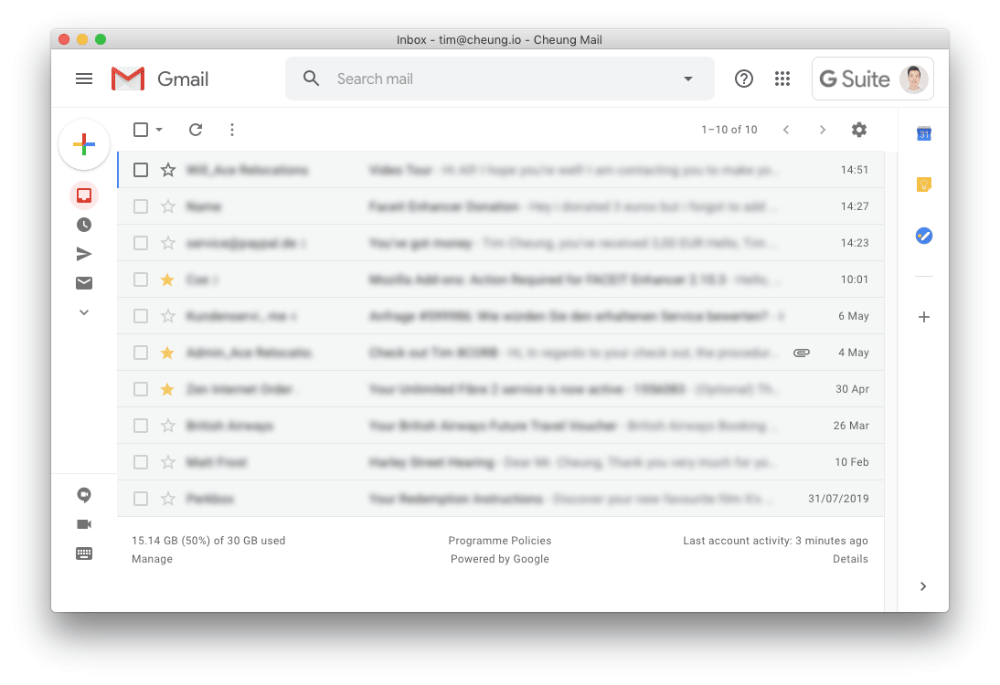
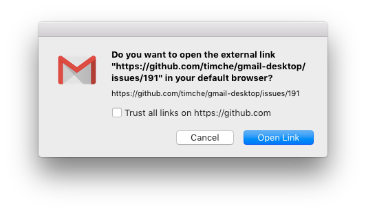
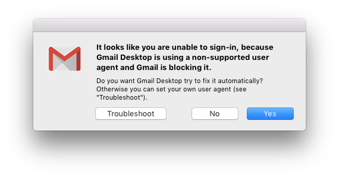

#  Gmail Desktop


[](https://github.com/sindresorhus/xo)
[](https://github.com/prettier/prettier)

> Nifty Gmail desktop app


## Highlights

- [Appearance customizations](#appearance-customizations)
- [Custom styles](#custom-styles)
- Desktop notifications
- macOS: Unread badge in dock
- Windows/Linux: Unread icon tray
- Silent auto-updates
- [Clean email links from Google](#clean-email-links-from-google)
- [Confirm email links before opening to prevent phishing](#confirm-email-links-before-opening-to-prevent-phishing)
- Cross-platform

## Installation

_macOS 10.13+, Linux and Windows 8+ are supported (64-bit only)._

#### macOS

[**Download**](https://github.com/timche/gmail-desktop/releases/latest) the latest `.dmg` file.

Or with [Homebrew Cask](https://caskroom.github.io/): `brew install timche-gmail-desktop`

#### Linux

[**Download**](https://github.com/timche/gmail-desktop/releases/latest) the latest `.AppImage` or `.deb` file.

#### Windows

[**Download**](https://github.com/timche/gmail-desktop/releases/latest) the latest `.exe` file.

## Features

### Appearance customizations

Gmail Desktop provides a number of appearance customizations to improve and simplify the default Gmail styles. These customizations are enabled by default and configurable under the `Settings` → `Appearance` menu.

- `Compact Header`: Customizes the Gmail header to use a more compact style to provide a more native feel. This setting requires a restart to be applied.
- `Hide Footer`: Hides footer information text (storage used, terms links, etc.).
- `Hide Support`: Hides the support button in the header.



### Custom styles

In addition to the available appearance customizations, custom user styles can be applied. Click the menu item `Settings` → `Appearance` → `Custom Styles` to open the custom CSS file in the default editor for CSS files.

### Confirm email links before opening to prevent phishing

Confirm email links can be disabled at `Settings` → `Confirm External Links before Opening`.



### Clean email links from Google

Email links in Gmail are usually prepended with `https://google.com/url?q=<actual_url>`, which is not visible to the user. While we don't know exactly why or what it does, it's unnecesary and we believe it does some tracking stuff. Gmail Desktop automatically cleans links from this, so the actual URL will be directly opened in the browser.

## Troubleshooting

#### I can't sign in: `This browser or app may not be secure`

In December 2019 Google has decided to block unsupported user agents, such as Electron, from signing in to Google accounts for security reasons (related issue: [#174](https://github.com/timche/gmail-desktop/issues/174)). This only affects some users, but not all.

We doubt this will ever change, so we are required to override the Electron default user agent with a supported user agent in order to sign in successfully.

Gmail Desktop offers to attempt to automatically fix the user agent when the issue above occurs:



Clicking on `Yes` will set a [custom user agent (based on Firefox)](https://github.com/timche/gmail-desktop/blob/master/src/user-agents.json) in the app config we think should work and Gmail Desktop will be restarted.

In case the custom user agent isn't working anymore, you'll be offered to let Gmail Desktop to attempt to fix it again or trigger it manually at `Settings` → `Advanced` → `User Agent` → `Attempt User Agent Fix`.

If the automatic user agent fix isn't working at all or you want to set your own custom user agent, you are able to set the user agent at `Settings` → `Advanced` → `User Agent` → `Set Custom User Agent`, which opens the app config in your editor.

In the app config, edit the `customUserAgent` value with an user agent from e.g. https://www.whatismybrowser.com/guides/the-latest-user-agent.

Example:

```json
{
  "customUserAgent": "Some User Agent"
}
```

Save the config, restart Gmail Desktop and sign in again.

## Developing

Built with [Electron](https://github.com/electron/electron).

#### Install

```sh
yarn install
```

#### Run

```sh
yarn start
```

#### Build

```sh
# Compile TypeScript files
yarn compile

# Build app for all targets
yarn build

# Or build app for specific target
yarn build:<macos|linux|windows>
```

The build output can be found in the `dist/` folder.

## Maintainers

- [Tim Cheung](https://github.com/timche)
- [Mark Skelton](https://github.com/mskelton)

## Contributors

Thanks goes to these wonderful people ([emoji key](https://allcontributors.org/docs/en/emoji-key)):

<!-- ALL-CONTRIBUTORS-LIST:START - Do not remove or modify this section -->
<!-- prettier-ignore-start -->
<!-- markdownlint-disable -->
<table>
  <tr>
    <td align="center"><a href="http://www.ramin.it"><br /><sub><b>Ramin Banihashemi</b></sub></a><br /><a href="https://github.com/timche/gmail-desktop/commits?author=bsramin" title="Code">💻</a> <a href="#ideas-bsramin" title="Ideas, Planning, & Feedback">🤔</a></td>
    <td align="center"><a href="https://github.com/cdloh"><br /><sub><b>Callum Loh</b></sub></a><br /><a href="https://github.com/timche/gmail-desktop/commits?author=cdloh" title="Code">💻</a></td>
    <td align="center"><a href="https://github.com/herrevilkitten"><br /><sub><b>herrevilkitten</b></sub></a><br /><a href="https://github.com/timche/gmail-desktop/commits?author=herrevilkitten" title="Code">💻</a></td>
    <td align="center"><a href="https://zhuzilin.github.io/"><br /><sub><b>Zilin Zhu</b></sub></a><br /><a href="https://github.com/timche/gmail-desktop/commits?author=zhuzilin" title="Code">💻</a></td>
    <td align="center"><a href="https://volution.ro/ciprian"><br /><sub><b>Ciprian Dorin Craciun</b></sub></a><br /><a href="#ideas-cipriancraciun" title="Ideas, Planning, & Feedback">🤔</a></td>
    <td align="center"><a href="https://github.com/cyfrost"><br /><sub><b>Cyrus Frost</b></sub></a><br /><a href="https://github.com/timche/gmail-desktop/commits?author=cyfrost" title="Code">💻</a> <a href="#maintenance-cyfrost" title="Maintenance">🚧</a></td>
    <td align="center"><a href="https://www.zzpxyx.com"><br /><sub><b>Zhipeng Zhang</b></sub></a><br /><a href="https://github.com/timche/gmail-desktop/commits?author=zzpxyx" title="Code">💻</a></td>
  </tr>
  <tr>
    <td align="center"><a href="https://github.com/hell0-Wor1d"><br /><sub><b>Jérôme Lemaire</b></sub></a><br /><a href="https://github.com/timche/gmail-desktop/commits?author=hell0-Wor1d" title="Code">💻</a></td>
    <td align="center"><a href="https://github.com/weichenw"><br /><sub><b>Wei Chen</b></sub></a><br /><a href="#platform-weichenw" title="Packaging/porting to new platform">📦</a></td>
  </tr>
</table>

<!-- markdownlint-enable -->
<!-- prettier-ignore-end -->

<!-- ALL-CONTRIBUTORS-LIST:END -->

This project follows the [all-contributors](https://github.com/all-contributors/all-contributors) specification. Contributions of any kind welcome!

## Disclaimer

Gmail Desktop is a third-party app and not affiliated with Google.
