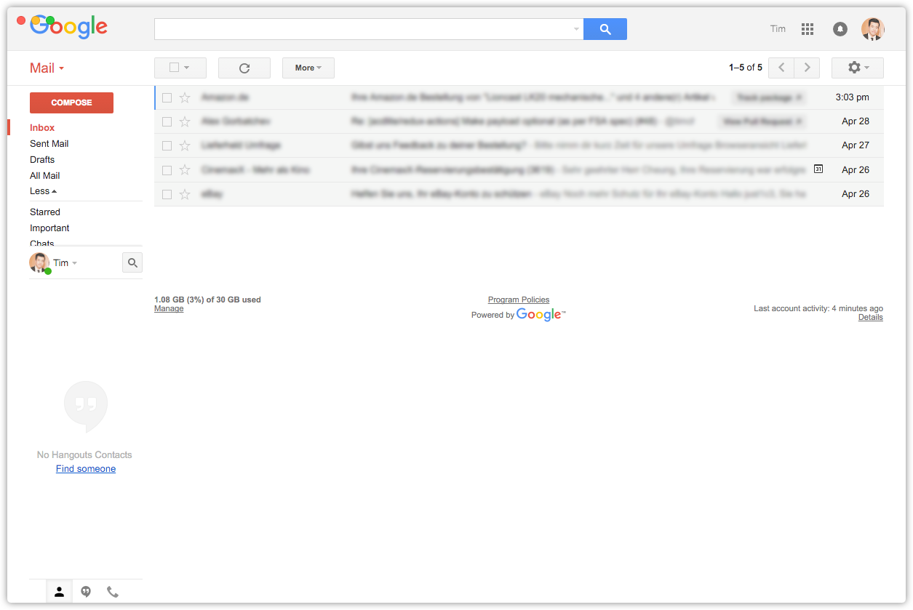

#  Gmail Desktop

[](https://travis-ci.org/timche/gmail-desktop)
[](http://standardjs.com/)

> An unofficial Gmail Desktop App built with [Electron](https://github.com/electron/electron)



**Features:**
- Original Gmail Interface
- Native Notifications
- Unread Inbox Count (OS X only)

**Supported OS:**
- [x] OS X 10.9+
- [ ] Windows 7+
- [ ] Linux

## Installation

#### OS X
1. [Download latest release](https://github.com/timche/gmail-desktop/releases).
1. Unzip it.
1. Move `Gmail Desktop.app` to `/Applications`.

## Development
Gmail Desktop is built with [Electron](https://github.com/electron/electron).

1. **Clone this repository:**

  ```bash
  $ git clone git@github.com:timche/gmail-desktop.git
  $ cd gmail-desktop
  ```
1. **Install npm dependencies:**

  ```bash
  $ npm install
  ```

#### Commands
- **Run the app:**

  ```bash
  $ npm start
  ```

- **Lint:**

  ```bash
  $ npm run lint
  ```

- **Build OS X:**

  ```bash
  $ npm run build:osx
  ```

- **Build all platforms:**

  ```bash
  $ npm run build
  ```

## To-Do
- [ ] Multi Gmail Accounts.
- [ ] Adjust UI so OS X window buttons don't overlay Google Logo.
- [ ] Add Auto Updater.
